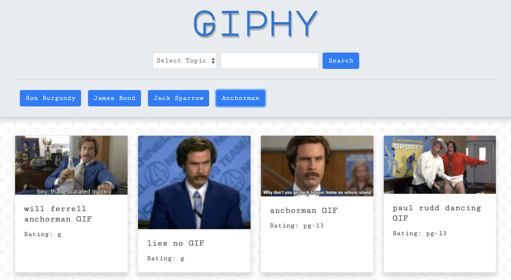

# GIF Search App

Application for searching gifs. 

## Getting Started
Instructions:
1. Select topic from dropdown menu.

2. Example search queries are provided in the form of buttons. Enter a new value in the search field then press "Submit" or enter to add new button. 

3. Click a button to retrieve gifs

4. Clicking on a gif's image will pause and play it

## Built With
* HTML5
* CSS3
    - @media queries
    - Bootstrap 4
* JavaScript
    - jQuery
    - AJAX
    - API

## Authors
Mike Hume

